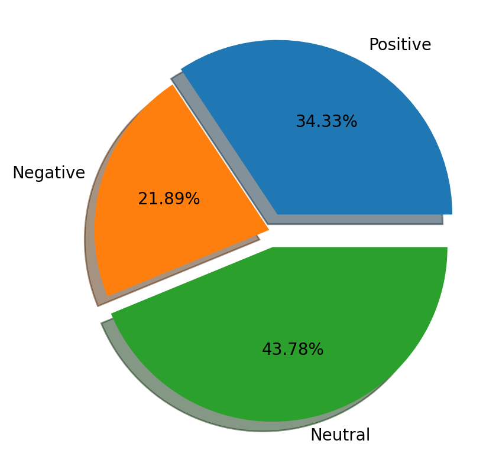
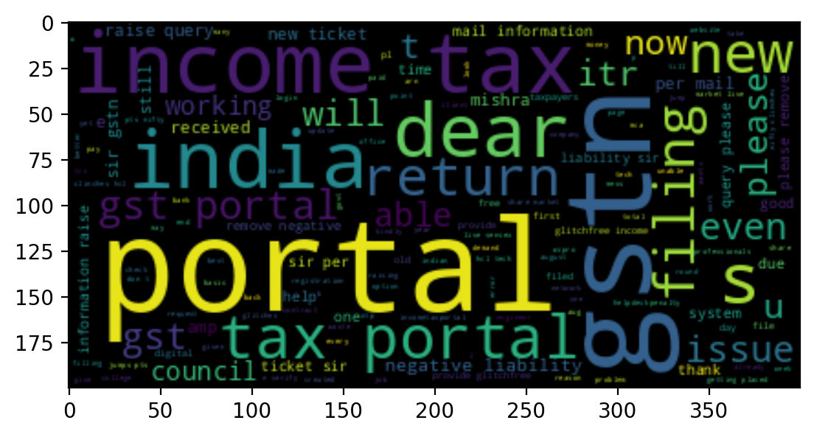
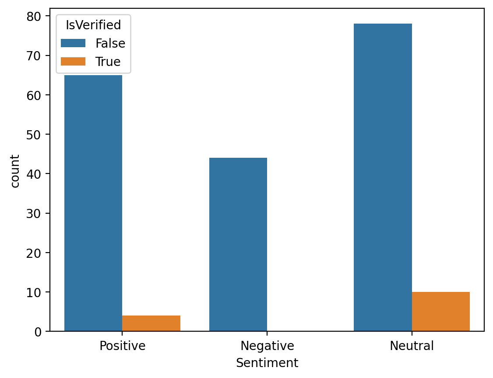

# Twitter_sentiment_Analysis
A Twitter Sentiment analysis Project which will scrap twitter for the topic selected by the user.
The extracted tweets will then be used to determine the Sentiments of those tweets. 
The different Visualizations will help us get a feel of the overall mood of the people on Twitter regarding the topic we select.
# USE CASES:
I use this project to gain information about various stocks and mutual funds.this helps me in updating my portfolio and also keep track of news
circulating in the market.
#Heroku link
https://sentimentanalysisram.herokuapp.com/

#Examples of Data Analysis Visualizations

#Tweets are extracted real time ,Example

#if you have any doubt or facing some difficulty in reproducing this project ,please reach out to me on linkedin or gmail.
